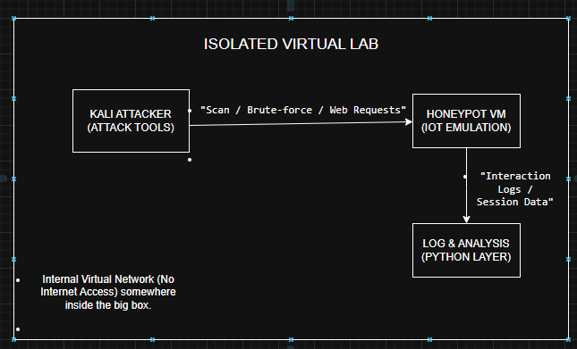
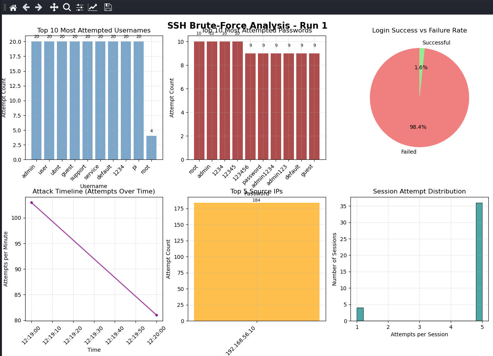
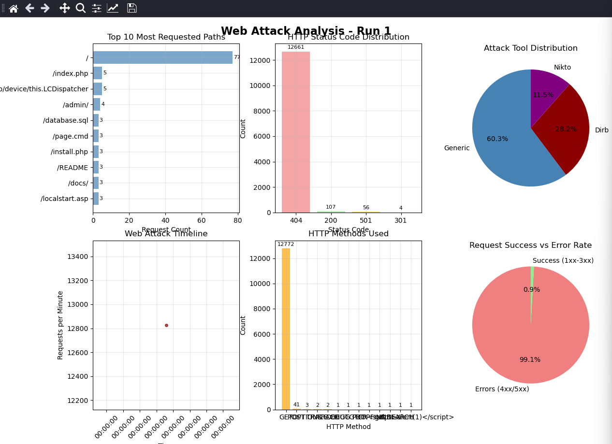
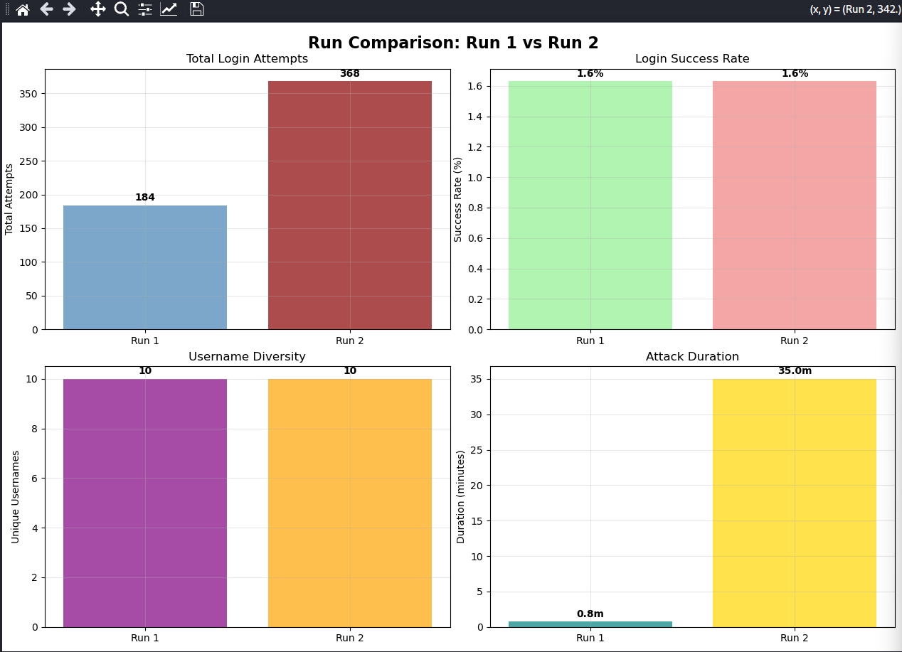

<div align="center">

# IoT Honeypot & Threat Analysis

**A virtualised medium-interaction honeypot for capturing and analysing IoT-targeted brute-force activity**

BSc Cyber Security — Final Year Project · Nottingham Trent University

[](https://github.com/cowrie/cowrie)
[](https://www.virtualbox.org/)
[](https://www.python.org/)
[]()
[](LICENSE)

</div>

---

## Overview

This project deploys a **Cowrie** medium-interaction honeypot, configured to impersonate a vulnerable Internet-of-Things (IoT) device, inside an isolated VirtualBox network. The honeypot exposes SSH and Telnet — the two services most aggressively targeted by IoT botnets such as **Mirai** and its derivatives — and records every connection, authentication attempt, and post-login command in structured JSON.

Captured telemetry was then processed with a custom **Python analysis pipeline** to quantify attacker behaviour, profile the credential dictionaries in use, reconstruct attack timelines, and produce the threat-intelligence findings documented in this repository.

Across the capture window the honeypot logged **552 authentication attempts** against the emulated device, of which **98.4% failed** — a clear signature of automated dictionary-based brute forcing rather than targeted human access.

> **Why it matters:** IoT devices ship with weak, well-known default credentials and are rarely patched. Honeypots let defenders observe exactly which credentials, tools, and behaviours adversaries use against these devices — intelligence that feeds detection rules, blocklists, and hardening guidance.

---

## Objectives

1. **Deploy** a realistic, low-risk IoT honeypot in a fully isolated virtual environment.
2. **Capture** SSH/Telnet authentication attempts and post-exploitation activity safely.
3. **Quantify** attack volume, success/failure rates, and temporal patterns.
4. **Profile** the username/password dictionaries used against IoT services and map them to known botnet credential sets.
5. **Automate** the analysis and reporting workflow in Python so results are reproducible.
6. **Translate** raw logs into actionable, well-presented threat intelligence and defensive recommendations.

---

## Tools & Technologies

| Category | Tooling |
|---|---|
| Honeypot engine | [Cowrie](https://github.com/cowrie/cowrie) (medium-interaction SSH/Telnet) |
| Virtualisation | Oracle VirtualBox — Host-Only isolated network |
| Honeypot host | Ubuntu Server 22.04 LTS |
| Adversary emulation | Kali Linux (Hydra / Nmap / Nikto / Dirb) |
| Traffic redirection | `iptables` (NAT redirect 22→2222, 23→2223) |
| Log format | Cowrie structured JSON (`cowrie.json`) |
| Analysis & visualisation | Python 3, pandas, matplotlib, NumPy |
| Frameworks referenced | MITRE ATT&CK, Cyber Kill Chain |

---

## Architecture

```
                         VirtualBox Host-Only Network (192.168.56.0/24)
   ┌─────────────────────────┐                         ┌──────────────────────────────┐
   │   Kali Linux (Attacker) │   SSH :22  / Telnet :23 │   Ubuntu Server 22.04 (Sensor)│
   │   Hydra · Nmap · Nikto  │ ──────────────────────▶ │   ┌────────────────────────┐  │
   │   Dirb · manual probing │                         │   │  iptables NAT redirect │  │
   └─────────────────────────┘                         │   │   22 → 2222 (SSH)      │  │
                                                        │   │   23 → 2223 (Telnet)  │  │
                                                        │   └───────────┬────────────┘  │
                                                        │               ▼               │
                                                        │   ┌────────────────────────┐  │
                                                        │   │   Cowrie honeypot       │  │
                                                        │   │   hostname: iot_device  │  │
                                                        │   │   → var/log/cowrie.json │  │
                                                        │   └───────────┬────────────┘  │
                                                        └───────────────┼───────────────┘
                                                                        ▼
                                                          Python analysis pipeline
                                                       (credentials · timeline · IPs)
```

The Host-Only adapter guarantees the honeypot **cannot reach the public internet**, so captured activity is contained and the lab carries no risk to third parties.



*High-level system architecture: isolated attack, honeypot, and analysis layers.*

---

## Methodology

The work followed a five-phase pipeline. Full detail is in [`docs/methodology.md`](docs/methodology.md).

1. **Environment build** — Isolated Host-Only network; Ubuntu sensor + Kali attacker provisioned in VirtualBox.
2. **Honeypot configuration** — Cowrie installed and tuned to present as an IoT device (`hostname = iot_device`), with SSH and Telnet enabled and `iptables` redirecting the standard ports to Cowrie's high ports. See [`config/`](config/).
3. **Attack generation & capture** — Dictionary-based brute force (Hydra) plus web/service probing (Nikto, Dirb) driven from Kali against the sensor, with the IoT-style credential dictionaries in [`wordlists/`](wordlists/).
4. **Data processing** — Cowrie JSON parsed into pandas; login events classified as success/failure; credentials, source IPs, sessions and timestamps aggregated. See [`analysis/`](analysis/).
5. **Reporting** — Findings visualised and written up as a threat-intelligence report with defensive recommendations.

---

## Key Findings

> Full write-up: **[`docs/threat-intelligence-report.md`](docs/threat-intelligence-report.md)**

| Metric | Value |
|---|---:|
| Total authentication attempts | **552** |
| Failed authentications | **543 (98.4%)** |
| Successful authentications | **9 (1.6%)** |
| Protocols targeted | SSH (2222) · Telnet (2223) |
| Unique usernames attempted | 10 |
| Unique passwords attempted | 20 |
| Credential set profile | Classic IoT / **Mirai-family** defaults |

**Headline observations**

- The **98.4% failure rate** is characteristic of automated, dictionary-driven brute forcing. The only credentials that succeeded — `root:root`, `admin:admin`, `admin:1234` — are all manufacturer defaults, and exactly the three pairs the honeypot was configured to accept (≈1.6% of a 200-pair wordlist pass).
- **Direct Mirai overlap:** 7 of 10 usernames and 9 of 20 passwords match the credential dictionary hard-coded into the original **Mirai** botnet source — including IoT-specific defaults `xc3511` (XiongMai cameras), `vizxv` (Dahua DVRs), `888888`, and `ubnt` (Ubiquiti). This confirms the honeypot was correctly perceived as an IoT target.
- **Timing fingerprints automation:** Run 1 completed in a sub-minute burst; Run 2 ran ~35 minutes with an initial spike then throttled tail (Hydra adaptive rate-limiting). Sessions held 1–5 attempts each (parallel-threaded tooling), not interactive human access.
- **Web probing:** ~12,828 HTTP requests/run from Nikto + Dirb at a **99.1% error rate** — a complete inventory of the admin endpoints and vulnerability signatures automated infrastructure currently targets.
- **Reconnaissance:** Nmap `-sV` scans correctly fingerprinted the emulated SSH (22) and Telnet (23) services across all runs.

All captured traffic originated from a single isolated lab source (`192.168.56.10`); this is a controlled, contained study rather than an internet-facing capture, so geographic attribution is treated as a method for live deployment rather than a finding.

---

## Repository Structure

```
iot-honeypot/
├── README.md                         # You are here
├── LICENSE                           # MIT
├── requirements.txt                  # Python dependencies for the analyser
├── .gitignore
│
├── config/                           # Honeypot configuration (sanitised)
│   ├── cowrie.cfg                    # Cowrie overrides — IoT persona, SSH+Telnet
│   ├── userdb.txt                    # Authentication policy
│   └── iptables_rules.txt            # Port-redirect NAT rules
│
├── wordlists/                        # Credential dictionaries used in testing
│   ├── users.txt
│   └── passwords.txt
│
├── analysis/
│   └── enhanced_credential_analyzer.py   # Python analysis & visualisation pipeline
│
├── data/                             # Log inputs (see data/README.md)
│   ├── README.md                     # Expected schema + sanitisation policy
│   └── sample/
│       └── cowrie_sample.json        # Small synthetic sample for reproducibility
│
├── results/                          # Generated charts & analyst output
│   └── README.md
│
└── docs/
    ├── deployment_guide.md           # Step-by-step build instructions
    ├── methodology.md                # Detailed research methodology
    └── threat-intelligence-report.md # Formal TI report (findings)
```

---

## Setup & Reproduction

### 1. Build the honeypot
Follow [`docs/deployment_guide.md`](docs/deployment_guide.md) to stand up the isolated VirtualBox network, install Cowrie on the Ubuntu sensor, and apply the configuration in [`config/`](config/).

### 2. Run the analysis pipeline
```bash
# Clone
git clone https://github.com/HarryKlrr/iot-honeypot.git
cd iot-honeypot

# (Recommended) virtual environment
python3 -m venv venv && source venv/bin/activate

# Dependencies
pip install -r requirements.txt

# Run against the Cowrie JSON logs (a sample log is in data/sample/)
python3 analysis/enhanced_credential_analyzer.py
```

The script ingests Cowrie JSON, prints summary statistics, and writes the visualisations to [`results/`](results/).

---

## Results

### SSH brute-force analysis



*Six-panel SSH dashboard (Run 1, 184 attempts): top usernames, top passwords, the 98.4% / 1.6% success split, attack timeline, source-IP distribution, and per-session attempt distribution. The near-uniform username counts and the concentration on IoT default passwords are the fingerprint of automated, dictionary-driven brute forcing.*

### Web probing analysis



*Six-panel web dashboard (Run 1): top requested paths, HTTP status-code distribution (99.1% errors), Nikto/Dirb tool attribution, request timeline, HTTP methods, and error rate.*

### Cross-run reproducibility



*Run 1 vs Run 2 scale proportionally (184 → 368 attempts) at a constant 1.6% success rate — evidence the honeypot logs deterministically under increasing load.*

Additional charts (`credential_analysis_run_2.png`, `web_analysis_run_2.png`, `run_comparison_web.png`, analyzer console output) are in [`results/`](results/). Evidence screenshots (Nmap, Hydra, tcpdump) and architecture diagrams are in [`docs/screenshots/`](docs/screenshots/) and [`docs/diagrams/`](docs/diagrams/).

See [`docs/threat-intelligence-report.md`](docs/threat-intelligence-report.md) for the interpreted findings and defensive recommendations.

---

## Defensive Recommendations (summary)

- **Eliminate default credentials** and enforce per-device unique passwords; disable Telnet entirely.
- **Restrict management interfaces** (SSH/Telnet) to trusted networks; never expose them to the public internet.
- **Deploy key-based SSH** and disable password authentication where feasible.
- **Rate-limit and blocklist** repeat offenders (e.g. `fail2ban`), and feed observed source IPs into threat blocklists.
- **Monitor** for the credential patterns identified here as high-confidence indicators of IoT-botnet scanning.

---

## Ethics & Responsible Use

This honeypot was operated in a **fully isolated Host-Only network** with no route to the public internet. No third-party systems were accessed and no real user data was collected. Configuration files in this repository are **sanitised** — secrets, keys, and any host-identifying addresses have been removed. The credential dictionaries are published default lists already in the public domain (e.g. the Mirai source release) and are provided strictly for defensive research and education.

---

## Author

**Harry Klair** — BSc Cyber Security (Hons), Nottingham Trent University
Portfolio: [harryklrr.github.io](https://harryklrr.github.io) · GitHub: [@HarryKlrr](https://github.com/HarryKlrr)

## License

Released under the [MIT License](LICENSE).
