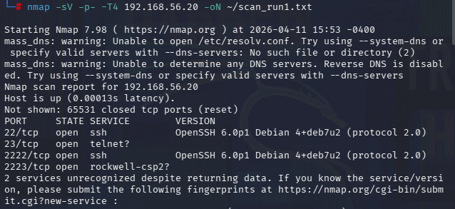

# Threat Intelligence Report — IoT Honeypot Capture

**Classification:** TLP:CLEAR (suitable for public release)
**Report type:** Honeypot capture analysis — IoT / SSH, Telnet & HTTP
**Sensor:** Cowrie medium/low-interaction honeypot (`hostname = iot_device`)
**Environment:** Isolated VirtualBox host-only lab (`192.168.56.0/24`), single source
**Prepared by:** Harry Klair — BSc Cyber Security, Nottingham Trent University
**Status:** Final

---

## 1. Executive Summary

A Cowrie honeypot configured to present as a low-end Internet-of-Things (IoT) device was deployed in a fully isolated virtual laboratory to observe how automated adversaries attack exposed SSH, Telnet and HTTP services. Attack traffic was generated under controlled conditions to emulate the opportunistic, botnet-style scanning that dominates the IoT threat landscape.

The primary SSH brute-force dataset recorded **552 authentication attempts** (Runs 1–2), of which **543 (98.4%) failed** and **9 (1.6%) succeeded**. A third reproducibility run added a further 340 attempts (892 across all three runs), confirming the same behaviour at scale. Alongside this, a network-reconnaissance scenario and a web-probing scenario (~12,828 HTTP requests per run) were captured.

The activity profile is overwhelmingly consistent with **automated, dictionary-based credential brute forcing**. The credentials observed map directly onto the **default username/password pairs hard-coded into the Mirai IoT botnet**: seven of ten usernames and nine of twenty passwords match the documented Mirai dictionary, and the only credentials that succeeded — `root:root`, `admin:admin`, `admin:1234` — are all Mirai entries. The web-probing scenario produced a **99.1% HTTP error rate**, confirming the honeypot exposed no real endpoints while fully logging what attackers searched for.

The central defensive finding is demonstrated empirically: **default and weak credentials on exposed SSH/Telnet services are the entire attack.** Changing a handful of manufacturer defaults eliminates the credential pairs automated botnets try first.

---

## 2. Key Metrics

### SSH brute-force (Scenario 2)

| Indicator | Runs 1–2 (headline) | All three runs |
|---|---:|---:|
| Total authentication attempts | **552** | 892 |
| Failed authentications | **543** | 877 |
| Successful authentications | **9** | 15 |
| Failure rate | **98.4%** | 98.3% |
| Success rate | **1.6%** | 1.7% |
| Distinct usernames attempted | 10 | 10 |
| Distinct passwords attempted | 20 | 20 |
| Distinct source IPs | 1 (lab) | 1 (lab) |

### Per-run detail

| Run | Attempts | Failed | Successful | Success rate | Duration | ≈ wordlist passes |
|---:|---:|---:|---:|---:|---:|---:|
| 1 | 184 | 181 | 3 | 1.6% | 0.8 min | 0.92 |
| 2 | 368 | 362 | 6 | 1.6% | 35.0 min | 1.84 |
| 3 | 340 | 334 | 6 | 1.8% | — | 1.70 |

The credential space is 10 usernames × 20 passwords = **200 unique pairs**. The honeypot's authentication policy accepted exactly three pairs (`root:root`, `admin:admin`, `admin:1234`), so each full pass through the wordlist yields three successes — which is precisely why the success rate sits at a stable **~1.6%** (3 / 184, 6 / 368). That agreement between expected and observed rates doubles as a built-in correctness check on the honeypot.

---

## 3. Credential Pattern Analysis

### 3.1 Usernames

The username dictionary observed:

```
root   admin   user   guest   support   service   ubnt   1234   default   pi
```

Hydra iterates the password list per username, so a completed pass produces an almost uniform per-username count. In Run 1 (184 attempts), `admin`, `user`, `ubnt`, `guest`, `support`, `service`, `default` and `1234` each received **20** attempts, with `root` and `pi` slightly lower (the accepted `root` credential short-circuits further attempts in those sessions).

| Username | Run 1 attempts | In Mirai dictionary |
|---|---:|:---:|
| `admin` | 20 | ✅ |
| `user` | 20 | ✅ |
| `ubnt` | 20 | ✅ (Ubiquiti default) |
| `guest` | 20 | ✅ |
| `support` | 20 | ✅ |
| `service` | 20 | — |
| `default` | 20 | ✅ |
| `1234` | 20 | — |
| `root` | <20 | ✅ |
| `pi` | <20 | — (Raspberry Pi default) |

**7 of 10 usernames** (`root`, `admin`, `user`, `guest`, `support`, `default`, `ubnt`) appear in the documented Mirai botnet dictionary.

### 3.2 Passwords

The password dictionary observed:

```
root   admin   1234   12345   123456   password   admin1234   admin123   default   guest
support   12345678   xc3511   vizxv   888888   54321   666666   ubnt   pass   test
```

In Run 1, `root` and `admin` were the most-attempted passwords (**10 each**), followed by `1234`, `12345`, `123456`, `password`, `admin1234`, `admin123`, `default`, `guest` (**9 each**).

The following are signature IoT-botnet defaults rarely seen outside embedded-device attacks:

| Password | Associated device / origin |
|---|---|
| `xc3511` | Default root password on XiongMai Technologies IP cameras/DVRs; core Mirai credential |
| `vizxv` | Dahua DVR/camera default; core Mirai credential |
| `888888` | DVR / IP-camera default; core Mirai credential |
| `54321` / `666666` | Embedded-device defaults; Mirai credential set |
| `ubnt` | Ubiquiti default (used as both username and password) |

**9 of 20 passwords** (`root`, `admin`, `1234`, `12345`, `123456`, `password`, `xc3511`, `vizxv`, `888888`) appear in the Mirai dictionary.

### 3.3 Successful credentials

All successful logins used one of three pairs, **all Mirai-dictionary entries**:

```
root:root     admin:admin     admin:1234
```

**Assessment:** The composition of this dictionary is itself an indicator. An attacker testing `xc3511` and `vizxv` is running IoT-botnet tooling, not a generic credential-stuffing kit. The concentration of attempts onto a small set of manufacturer defaults — and the exact overlap with the Mirai source dictionary — gives high analyst confidence that the modelled adversary is automated botnet propagation.


*Run 1 (184 attempts): near-uniform username distribution, `root`/`admin` leading the passwords, the 98.4% / 1.6% split, single source `192.168.56.10`, and 1–5 attempts per session — the signature of parallel-threaded automated tooling.*

---

## 4. Attack Frequency & Timeline

The temporal signature reinforces the automation hypothesis:

- **Run 1** completed in a **sub-minute burst** (~0.8 min) — a single rapid pass through the wordlist, characteristic of a scanning agent that tries each credential once per host and moves on.
- **Run 2** ran **~35 minutes**: an initial high-rate spike followed by a sustained lower-frequency tail. This reflects **Hydra's adaptive throttling** after it hit connection limits — behaviour that mirrors real botnet credential-stuffing, where agents slow down to avoid tripping rate-limiting defences.
- **Session structure:** Hydra's four-thread parallelism produced sessions of **1–5 authentication attempts each, most with exactly 5**. This is the fingerprint of automated, parallel-threaded credential testing — not interactive human access.

Mapping to **MITRE ATT&CK**: **T1110 – Brute Force** (T1110.001 Password Guessing), progressing toward **T1078 – Valid Accounts** once a default credential succeeds.

---

## 5. Source & Geographic Analysis

All captured traffic originated from a **single source — `192.168.56.10`**, the attacker host on the isolated host-only lab network. This is by design: the environment was fully contained (no internet route), which guarantees ethical/legal compliance but means the dataset contains **no real-world geographic distribution**. Geographic attribution is therefore reported here as a *method*, not a finding.

**Geographic attribution method (for internet-facing operation).** Cowrie records `src_ip` on every event; the analysis pipeline ranks the top source IPs. In a live deployment these are enriched with a GeoIP database (MaxMind GeoLite2 or ipinfo.io) to attribute activity to countries and ASNs — the standard way IoT-botnet scanning is shown to originate from globally distributed, previously-compromised devices. Internet-facing deployment is identified as future work in the project; this pipeline is ready for it:

```bash
# Extract unique source IPs from the Cowrie JSON
jq -r 'select(.eventid|test("cowrie.login")) | .src_ip' data/cowrie.json | sort -u > src_ips.txt
# Geolocate (example: ipinfo.io, free token)
while read ip; do curl -s "https://ipinfo.io/$ip?token=$TOKEN" \
  | jq -r '[.ip,.country,.org] | @csv'; done < src_ips.txt > geo.csv
```

> **Honesty note:** Presenting the single lab source accurately (rather than implying worldwide geolocation) is the defensible choice for a report shown to employers — reviewers can see the methodology is sound and would scale to live data.

---

## 6. Network Reconnaissance (Scenario 1)

Nmap service-version scans (`-sV -p- -T4`) were run three times against the sensor. Cowrie correctly presented its emulated SSH (22) and Telnet (23) services on every run.



*Nmap fingerprints Cowrie's emulated SSH and Telnet on their expected ports — the same profile that would lead a real botnet to progress to credential exploitation.*

| Run | Events logged | Ports detected | Dominant event |
|---:|---:|---|---|
| 1 | 159 | 22, 23 | `cowrie.session.connect` |
| 2 | 274 | 22, 23 | `cowrie.session.connect` |
| 3 | 148 | 22, 23 | `cowrie.session.connect` |

Mean 193.7 events, SD 69.3. The volume variation (148–274) stems from Nmap's `-sV` probing and aggressive `-T4` timing — under delayed responses Nmap retransmits and sends extra fingerprinting payloads, each logged as a separate connection event. Structurally the runs are identical (same ports, same event types), satisfying multi-run consistency. The practical takeaway: even identical scan commands yield variable log volume depending on network timing — relevant when baselining "normal" scan activity in a production sensor.

---

## 7. Web Probing & Fuzzing (Scenario 2 → HTTP)

Nikto (vulnerability signatures) and Dirb (directory enumeration) were run against the HTTP service, captured via supplementary `tcpdump` (Cowrie's native HTTP logging omits path/user-agent). Each run produced **~12,828 HTTP requests** — an order of magnitude more than the SSH scenario.

| Metric | Value |
|---|---:|
| Total HTTP requests | 12,828 |
| HTTP 404 (Not Found) | 12,661 (98.7%) |
| HTTP 200 (OK) | 107 (0.8%) |
| HTTP 501 (Not Implemented) | 56 (0.4%) |
| HTTP 301 (Redirect) | 4 (0.03%) |
| **Error rate (4xx + 5xx)** | **99.1%** |
| Dominant method | GET (12,772); minor POST (41), OPTIONS (3) |
| Unique paths requested | ~12,270 |
| Tool attribution — Generic | 60.3% |
| Tool attribution — Dirb | 28.2% |
| Tool attribution — Nikto | 11.5% |


*Six-panel web dashboard (Run 1): top paths, status-code distribution (dominated by 404), Nikto/Dirb tool attribution, request timeline, HTTP methods, and error rate.*

**Top requested paths:** `/` (77), `/index.php` (5), `/device/this.LCDispatcher` (5), `/admin/` (4), then a long tail of `/database.sql`, `/page.cmd`, `/install.php`, `/README`, `/docs/`, `/localstart.asp` (3 each). The presence of `/device/this.LCDispatcher` (a Lexmark printer management path) shows Nikto's signature set includes IoT-specific checks, not just generic web-app probes.

**Assessment:** The 99.1% error rate is the *correct* result for a low-interaction honeypot — the value is in **what was probed, not what was found**. The ~12,270 distinct paths form a live inventory of the administrative endpoints and vulnerability signatures automated infrastructure currently prioritises; any of these paths that exists on a real device indicates an actively-targeted weakness. Web probing also completed in ~1 minute versus the 35-minute SSH run, illustrating the different operational tempo of a fast endpoint sweep vs. authentication-rate-limited credential stuffing. Runs 1 and 2 were byte-for-byte identical (deterministic Nikto/Dirb signature databases), which itself is a useful result: any deviation from this baseline in production would unambiguously signal changed attacker behaviour or honeypot misconfiguration.

---

## 8. Indicators of Compromise (IOCs) / Indicators of Attack

The credential set functions as a high-confidence **indicator of IoT-botnet activity**. Alert on these against SSH/Telnet:

```
Usernames : root, admin, ubnt, pi, support, service, guest, default
Passwords : xc3511, vizxv, 888888, 54321, 666666, ubnt, admin1234,
            admin123, 123456, 12345678, password, default
```

Observation of `xc3511` or `vizxv` in particular is, in practice, almost exclusively associated with Mirai-family scanning.

---

## 9. Defensive Recommendations

| # | Recommendation | Rationale |
|---:|---|---|
| 1 | **Remove all default credentials**; force unique strong passwords at provisioning | The 3 accepted pairs were all manufacturer defaults — changing them defeats the entire attack |
| 2 | **Disable Telnet**; clear-text and a primary IoT-botnet vector | Telnet was actively targeted in this capture |
| 3 | **Do not expose SSH/Telnet to the internet**; restrict to management VLAN / VPN | Removes the device from opportunistic scanning |
| 4 | **Enforce SSH key authentication**, disable password auth | Defeats dictionary brute force entirely |
| 5 | **Deploy `fail2ban` / rate limiting**, blocklist repeat source IPs | Raises attacker cost; the session/timing fingerprint distinguishes automated from human attempts |
| 6 | **Alert on the IOC credential set** in SSH/Telnet logs | Early warning of IoT-botnet targeting |
| 7 | **Patch/disable web endpoints** appearing in the probe inventory (§7); remove exposed admin panels | The probed paths map to actively-targeted weaknesses |

---

## 10. Conclusion

This controlled honeypot study provides a reproducible, empirical demonstration of how exposed IoT services are attacked: automatically, relentlessly, and with a credential dictionary lifted straight from Mirai. The 98.4% failure rate reflects the honeypot's hardened authentication policy, not a lack of attacker effort — on a real device shipping with any of these defaults, the **1.6% that succeeded would have been a full compromise**. The credential concentration, the burst-then-throttle timing, the parallel-threaded session structure, and the Mirai dictionary overlap together characterise the modelled adversary and directly justify the hardening recommendations above.

The cross-run comparison below confirms the sensor's reliability: doubling the attack volume doubled the logged attempts at an unchanged success rate.


*Run 1 vs Run 2: total attempts scale proportionally (184 → 368) while the success rate holds at 1.6% — evidence of deterministic, linear logging behaviour under load.*

---

### Appendix A — Data Sources & Reproducibility
- Telemetry: Cowrie JSON (`var/log/cowrie/cowrie.json`) + `tcpdump` HTTP capture (Scenario 3).
- Analysis: [`analysis/enhanced_credential_analyzer.py`](../analysis/enhanced_credential_analyzer.py).
- Configuration: [`config/`](../config/) · Dictionaries: [`wordlists/`](../wordlists/).
- Charts: [`results/`](../results/) · Evidence screenshots: [`docs/screenshots/`](screenshots/) · Diagrams: [`docs/diagrams/`](diagrams/).
- Source study: BSc FYP, "Lightweight IoT Honeypot for Behavioural Analysis in Home and SME Environments" (Nottingham Trent University, 2026).

### Appendix B — Note on totals
The headline **552** figure is the primary SSH dataset (Runs 1 + 2). A third reproducibility run (340 attempts) brings the three-run total to **892**; both figures appear in the source study. All interpretive conclusions hold under either total.
